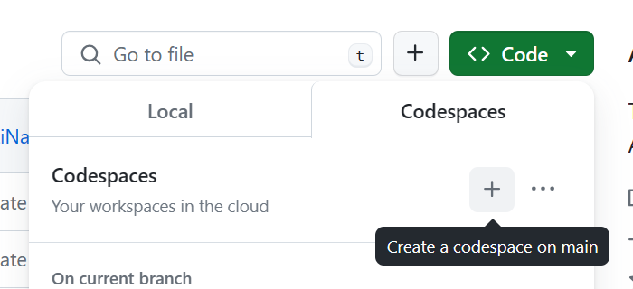
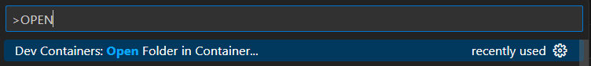

# Rstack

**Rstack** also known as the _Raul_ stack was built by the founder of [Hands In](https://handsin.com/) to reduce the time it takes for software startups to go from just an idea 💡 to building an MVP 🚀.

99% of the time when you start a software company tech teams spend months deciding on how to build a product without giving any thought to the non-functional parts of the job.
How can we monitor users? How can we tell if everything is working? How do you handle errors? How do we test new features?

Although there is no one-shoe-fits-all solution for developing a web-based product, most time wasted at a startup is deciding on how all of these should be accomplished rather than just focusing on building an MVP. We faced this problem for years on projects, and have come up with a full-fledged solution that gives you all the bells and whistles you need to start your web-based software, get to an MVP as soon as possible and iterate just as fast.

## How quick is it to get up and running?

You literally only need to do 2 things and your entire team can get started on shipping production software

```
1. Click this repository as a template (Yep... I actually count this as a step)
2. Open the repo using Github Codespace or via the VScode devcontainer extension
```
Github Codespace             |  VScode devcontainer
:-------------------------:|:-------------------------:
  |  

## Features include

- CI/CD via Github Actions with automatic building, testing and deployments to Vercel.
- Tailwind CSS + Daisy UI for speedy styling
- Nextjs 14 App Router framework
- TRPC for end-to-end type safety
- Auth setup including Google, Facebook and Email login.
- Posthog for session replays, and feature flags.
- SEO templates are all setup with sitemap, metadata, and robot generation.
- I18n internationalisation with custom type safe generation
- Preconfigured VScode extensions, including: eslint, prettier, spellchecker, i18n-ally, prisma, docker and mongodb playground.

## How Rstack compares to rolling your stack from scratch

_DX = Developer Experience_

